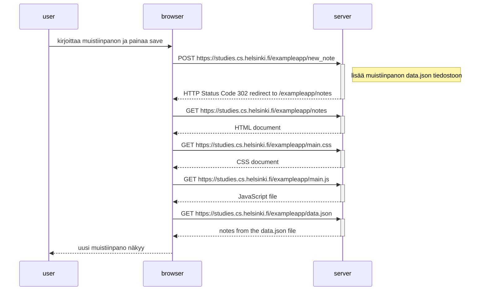

```mermaid
sequenceDiagram
    participant user
    participant browser
    participant server
    user->>browser: kirjoittaa muistiinpanon ja painaa save
    browser->>+server: POST https://studies.cs.helsinki.fi/exampleapp/new_note
    Note right of server: lisää muistiinpanon data.json tiedostoon
    server-->>-browser: HTTP Status Code 302 redirect to /exampleapp/notes
    browser->>+server: GET https://studies.cs.helsinki.fi/exampleapp/notes
    server-->>-browser: HTML document
    browser->>+server: GET https://studies.cs.helsinki.fi/exampleapp/main.css
    server-->>-browser: CSS document
    browser->>+server: GET https://studies.cs.helsinki.fi/exampleapp/main.js
    server-->>-browser: JavaScript file
    browser->>+server: GET https://studies.cs.helsinki.fi/exampleapp/data.json
    server-->>-browser: notes from the data.json file
    browser-->>user: uusi muistiinpano näkyy
```
