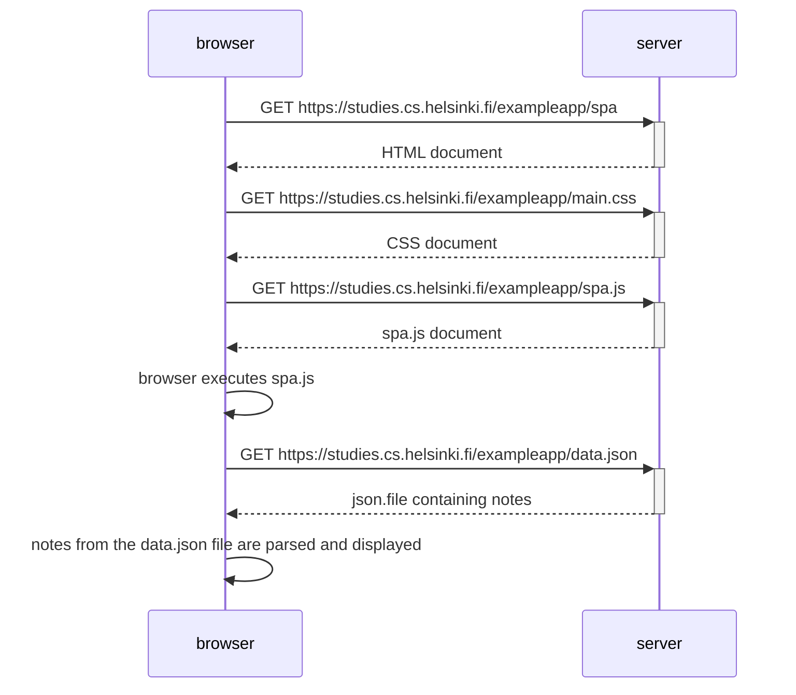

```mermaid
sequenceDiagram
    participant browser
    participant server
    browser->>+server: GET https://studies.cs.helsinki.fi/exampleapp/spa
    server-->>-browser: HTML document
    browser->>+server: GET https://studies.cs.helsinki.fi/exampleapp/main.css
    server-->>-browser: CSS document
    browser->>+server: GET https://studies.cs.helsinki.fi/exampleapp/spa.js
    server-->>-browser: spa.js document
    browser->>browser: browser executes spa.js
    browser->>+server: GET https://studies.cs.helsinki.fi/exampleapp/data.json
    server-->>-browser: json.file containing notes
    browser->>browser: notes from the data.json file are parsed and displayed
```
